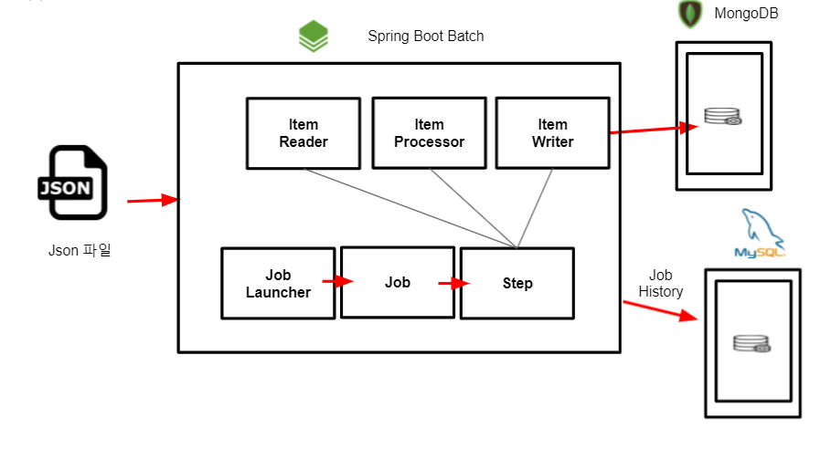
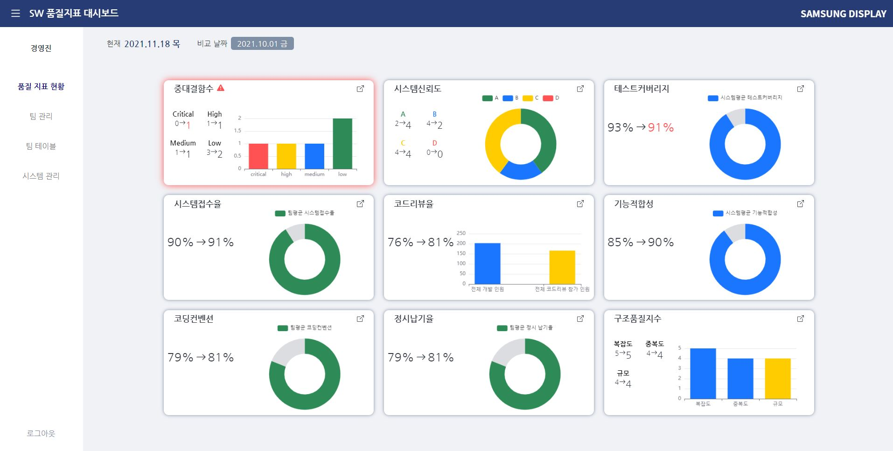
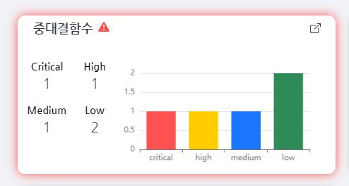
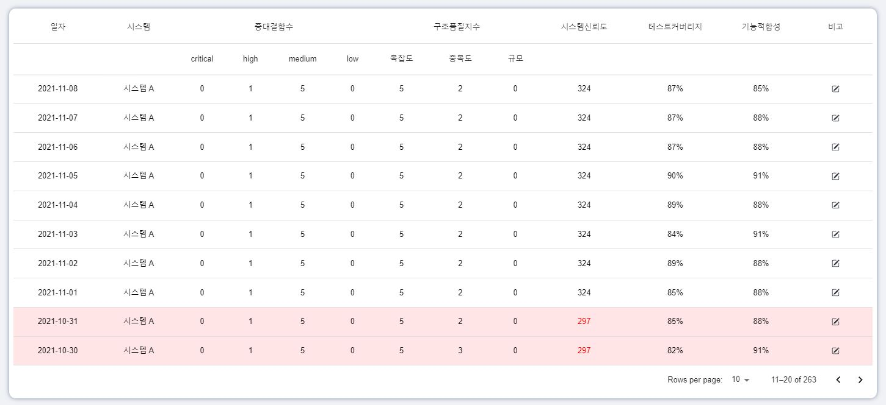
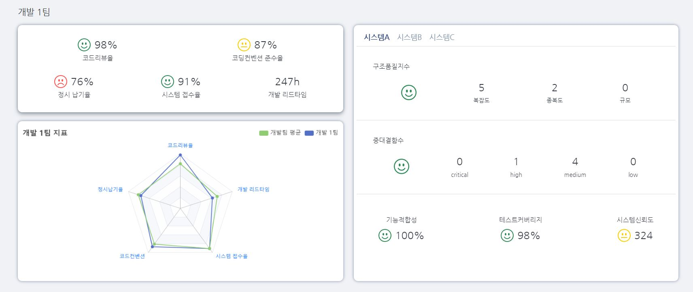

# S/W 품질지표 Dash Board 시스템 개발


### :bulb: Contributor

---

- #### Frontend : 김민환 남하은 변대웅

- #### Backend : 조원식 진수연


### :heavy_check_mark: 개발 기간

---

#### 2021.10.12 ~ 2021.11.19 (6주)


### :heavy_check_mark: 프로젝트 개요

---

- 다양한 S/W 시스템 및 모듈에서 전송된 품질 Raw데이터를 활용하여 전사 S/W 품질지표 현황을 한 눈에 확인 가능한 Dash Board 개발


### :heavy_check_mark: 기술 스택

---


### :heavy_check_mark: 아키텍처

---





### :heavy_check_mark: 프로젝트 세팅 방법

----

- [Frontend](./front)
- [Backend](./backend)
- [Batch](./batch)


### :heavy_check_mark: Dash Baord 주요 기능

---


#### 1. 9개의 지표 차트화


#### 2. 과거 일자와 오늘 데이터 비교




#### 3. 기준 미달 지표에 대한 하이라이트




#### 4. 일정 기간에 대한 지표 추이


#### 5. 테이블 형태로 데이터 출력

- 문제되는 지표 표시
- 메모 기능




####  6. 팀관련 지표 

- 지표의 상태를 표정으로 출력
- 전체 개발팀과 소속된 팀의 지표 비교 기능




## :heavy_check_mark: 프로젝트 기여방법


### :bulb: Custom Git Flow

1. `Branch 전략`

참고: https://techblog.woowahan.com/2553/

- master : 최종적으로 배포되는 브랜치
- develop : 다음 출시 버전을 개발하는 브랜치
- feature : 기능을 개발하는 브랜치
- release : 이번 출시 버전을 준비하는 브랜치
- hotfix : 출시 버전에서 발생한 버그를 수정 하는 브랜치

```shell
master
	└── release
	└── fix
	└── develop
         └── feature/front/기능이름
         └── feature/back/기능이름
        		
```


2. `Commit Message Format`

- 모든 커밋 메시지는 다음과 같은 형식을 따른다.

`<type>: <message> (#<issue number>)`

- 예) feat: Add User Login (#S05003-534)
- type은 다음과 같다.

```
types = {      
	feat: 새로운 기능에 대한 커밋      
	fix: 버그 수정에 대한 커밋      
	build: 빌드 관련 파일 수정에 대한 커밋      
	chore: 그 외 자잘한 수정에 대한 커밋      
	ci: CI관련 설정 수정에 대한 커밋      
	docs: 문서 수정에 대한 커밋      
	style: 코드 스타일 혹은 포맷 등에 관한 커밋      
	refactor:  코드 리팩토링에 대한 커밋      
	test: 테스트 코드 수정에 대한 커밋   
}
```

